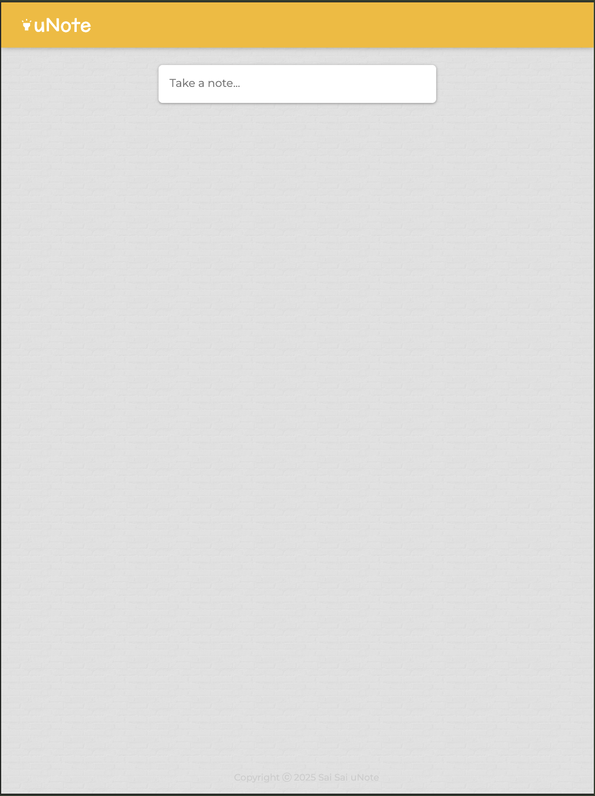
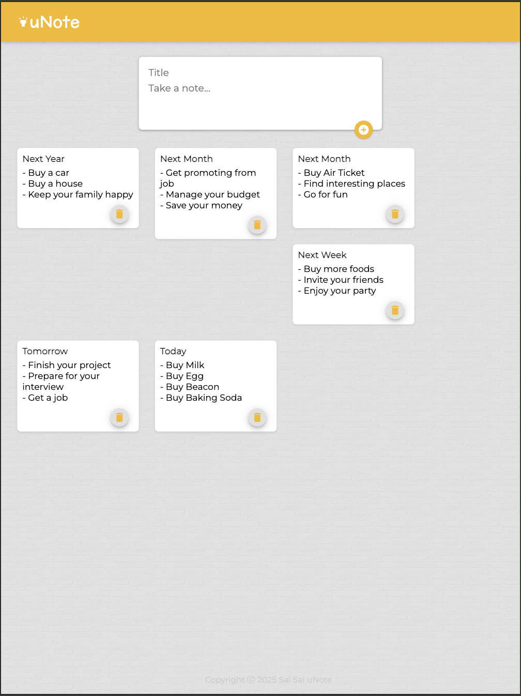

# U-Note 📝 – Fullstack Notes App

U-Note is a fullstack note-taking app built with React (Vite) and Node.js (Express), connected to a PostgreSQL database hosted on Render. It supports creating, viewing, and deleting notes. All features are managed within a unified project structure.

🔗 Live: u-note-umber.vercel.app
🔗 API: https://u-note.onrender.com

# 📸 Screenshots






# ✨ Features

📝 Create and view notes

🗑️ Delete notes

🌐 PostgreSQL-based persistent storage

⚛️ Built using React + Express in a monolithic setup

🌍 Fully deployed on Vercel (frontend) and Render (backend + DB)


# 🛠 Tech Stack

Frontend: React (Vite), Tailwind CSS

Backend: Node.js, Express

Database: PostgreSQL (Render)

Hosting: Vercel (UI) & Render (API & DB)


# 📁 Project Structure

u-note/
├── src/         # React components
├── db.js             # PostgreSQL connection setup
├── .env            # Environment variables (API keys, DB credentials)
├── server.js        # Main server entry
├── vite.config.js  # Vite config for frontend
└── README.md


# 🚀 Getting Started (Development)

Clone the repository
```bash
git clone https://github.com/zeethonSE/u-note.git
cd u-note
```

Install dependencies
```bash
npm install
```

Create a .env file
```bash
PORT=5000
DATABASE_URL=your_postgresql_connection_string
```

Start the app
```bash
npm run dev
```

Frontend will run at http://localhost:5173
Backend will run at http://localhost:5000/api/notes


# 📦 Deployment

Frontend is deployed on Vercel

Backend and PostgreSQL DB are hosted on Render

Ensure CORS settings in the backend allow access from your frontend domain.


# 🧠 Future Improvements

✏️ Add support for editing notes

🔐 Implement authentication (JWT or session)

🗂 Organize notes with categories or tags

☁️ Add cloud sync or backups


# 🙋‍♂️ Author

Sai Sai

💼 Web Developer

📧 zeethon0@gmail.com

🔗 [LinkedIn](https://linkedin.com/in/ssaiwd25)

# 📄 License

This project is open source and available under the [MIT License.](./LICENSE.txt)

